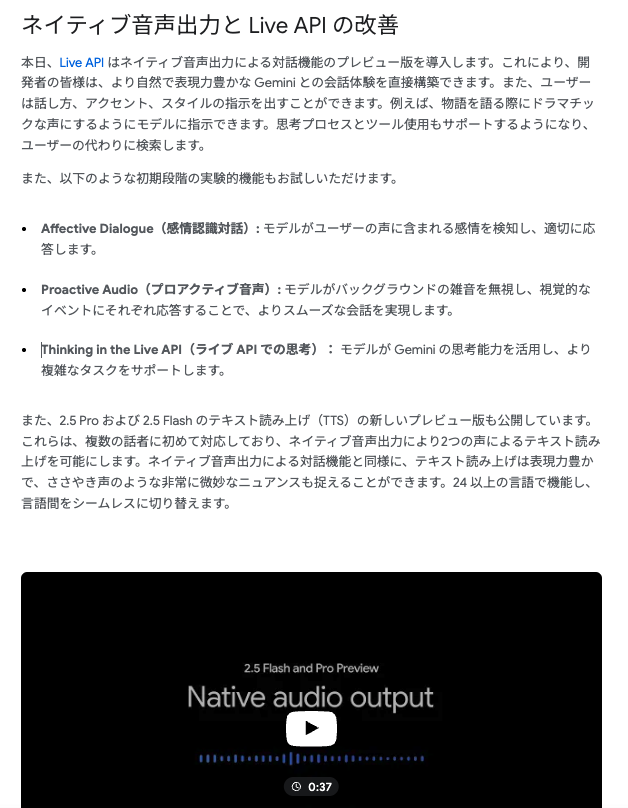

# 英語技術書の積読を NotebookLM で消化する(202505)

## +GoogleStudio AI でより深掘りたい

---

# 目次

1. 登壇者の英語能力紹介
2. 使用ツール
3. NotebookLM の活用
   - NotebookLM の簡単な紹介
   - デモンストレーション
   - NotebookLM での課題
4. Google AI Studio の活用
   - デモンストレーション
   - プロンプトの活用

---

# 自己紹介


## プロフィール

- 名前：菊池 雄登 / (HN)
- 所属：ぴあ株式会社 / PIA TECH LAB

## 最近ハマってる曲・アーティスト

- 曲：**色鯉**
- アーティスト：**空白ごっこ**

---

# 1. 登壇者の英語能力紹介

---

# 1. 登壇者の英語能力紹介

登壇者の英語能力
大体３年前に TOEIC680 点、おそらく衰退の一途を辿っている。
自分が英語ネイティブになるよりもほんやくコンニャクが出てくると思ってる。

---

# 2. 使うツール

---

# 2. 使うツール

| 項目 | 説明             | リンク                                      |
| ---- | ---------------- | ------------------------------------------- |
| 1    | NotebookLM       | https://notebooklm.google.com/              |
| 2    | Google AI Studio | https://aistudio.google.com/generate-speech |

---

# 3. NotebookLM を使う

---

# 3-1. NotebookLM の簡単な紹介

雑に PDF をぶん投げるだけで任意の言語でサマリ作ったり、マインドマップ作ったり、クイズを作ったり、音声概要を作ったりしてくれる。

---

# 3-2. とりあえずデモ

---

# 3-3. NotebookLM での課題

全体の概要しか生成できない。
->chapter ごとくらいでポッドキャストを作ってほしい。

> 文字ベースだったら章単位でサマリを作ったり、クイズ作ったり、etc なんでもできる

---

Google I/O 2025 にて
https://blog.google/intl/ja-jp/company-news/technology/google-gemini-updates-io-2025/


---

おっ

---

# 4 Google AI Studio の Generate speech を使ってみる

---

# 4-1. とりあえずデモ\_2

---

# 4-2. プロンプト

```
CHAPTER 1 Overview of Machine Learning Systems (機械学習システムの概要) // Chapterの名称
について、2人のホストがディスカッションする形のポッドキャストの台本を生成してください
また、テキストとしてコピーできるようにマークダウンの強調などは行わないでください

以下は出力フォーマットです
Please read aloud the following in a podcast interview style:
Speaker 1: We're seeing a noticeable shift in consumer preferences across several sectors. What seems to be driving this change?
Speaker 2: It appears to be a combination of factors, including greater awareness of sustainability issues and a growing demand for personalized experiences.
```

---

まとめ
もともと自分が避けてたおかしなイントネーションとかはかなり減った(０じゃない)
※去年の 10 月前後くらい？
個人的には聞けるレベル、通勤時間とお布団の中で使っていけそう
NoteBookLM だと 1 ヶ月、Google AI Studio をツア k ってだと 1 週間くらい継続できてる

---

今後の展望、
PDF をぶん投げるだけで技術書 -> ポッドキャスト出力のフローを作りたい
Generate speech は API 化されてるので台本の作り方が課題
Google AI Studio で雑に何章の台本を作ってっていっても NoteBookLM ほどうまくいかない
システムプロンプトがこぼれ落ちてくるかひたすらに PDCA を回すか...

---

# 以上。

TODO : 音声生成時にそこそこ時間があるので隙間 ß の話題を用意する
